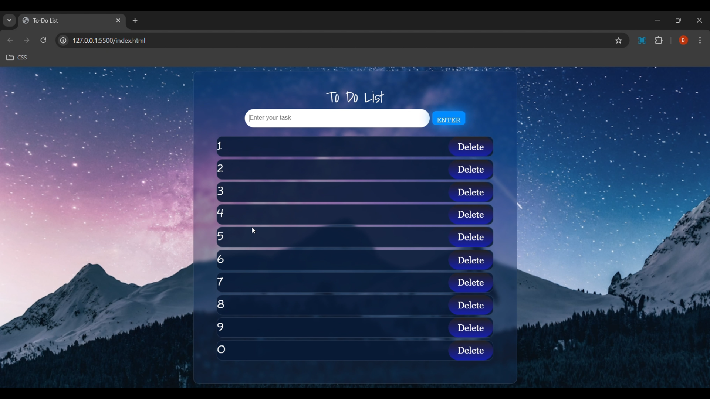

To-Do List App ✅
A sleek and efficient To-Do List web application built with HTML, CSS, and JavaScript. 
This project showcases DOM manipulation, local storage integration, and a modern user interface.

Features 🌟
Add Tasks: Enter tasks dynamically to the list.
Delete Tasks: Remove tasks with a single click.
Persistent Storage: Your tasks are saved in local storage, so you won’t lose them on page refresh.
Responsive Design: Optimized for all screen sizes.
Interactive UI: Clean, modern, and user-friendly interface.

How to Use? 🕹️
Open the application in your browser.
Enter your task in the input field and click "Enter" or press the Enter key.
Your tasks will appear below, with a Delete button for each.
Click the Delete button to remove a task from the list.

Demo 🖥️

Technologies Used 🛠️
HTML5: For structuring the application.
CSS3: For styling and creating a modern design.
JavaScript: For interactivity, dynamic DOM updates, and local storage integration.

Credits 🙌
Developed by Balavignesh J. Inspired by the need to organize tasks efficiently.
